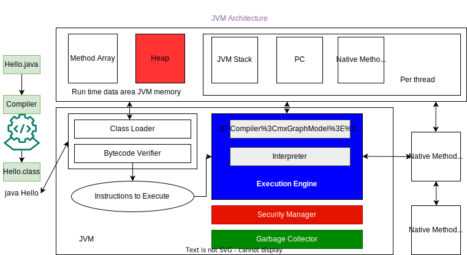
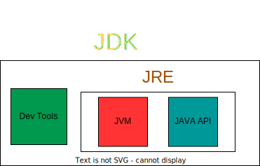
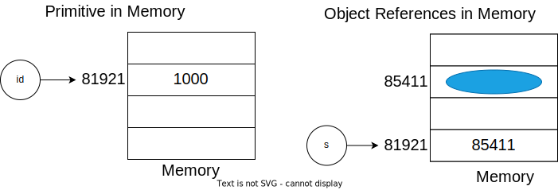

# JAVA

[⬅️ Back to home](/my-guide)

## Quiz

* What is Java?
* Why use Java?
* What are low level languages and why are they called as such?
* What are high level languages and why are they called as such?
* Can you please specify what are programming languages which are compiled to another programming languages?
* Why are we using public for only one class?

    <details>
    <summary>▶️ Solution</summary>
    It is how it has been designed and I am not sure if the reason is  documented. But here is a good reason on why it is done that way. Let's  assume we have two public classes Y & Z in a  file named Y.java.  Now, let's assume a different class X is using Z.  Now, when we compile  X, the compiler first tries to locate Z.class and if it cannot find it,  then it tries to locate Z.java so that it can compile it automatically.  But, since we only have Y.java, the class Z  cannot be located and hence  we get a compilation error. So, we do need  to place them in separate  files.
    </details>
* What is object oriented programming?

    <details>
    <summary>▶️ Solution</summary>
    Object-oriented programming (OOP) is a computer programming model that organizes software design around data, or objects, rather than functions and logic. An object can be defined as a data field that has unique attributes and behavior.
    </details>

* What are the primitive data types available in Java?

    <details>
    <summary>▶️ Solution</summary>
      boolean
      byte      - Integer
      short     - Integer
      int       - Integer
      long      - Integer
      float     - Floating-point
      double    - Floating-point
      char      - Character
    </details>

<!-- tooltips -->
*[JVM]: Java Virtual Machine
*[JIT]: Just In Time
*[JDK]: Java Development Kit
*[SDK]: Software Development Kit
<!-- tooltips end -->

## Documentation / Specification

[Java API 13](https://docs.oracle.com/en/java/javase/13/docs/api/index.html)
[Java SE specifications](https://docs.oracle.com/javase/specs/)

## Notes

1️⃣🚩Reference
[Course: Java In-Depth: Become a Complete Java Engineer! by Dheeru Mundluru from Udemy](https://www.udemy.com/course/java-in-depth-become-a-complete-java-engineer/)
other recommended books/materials:
Reference: <https://www.coolworkx.com/Effective%20Java,%203rd%20Edition.pdf>

📘 Section 1: Java - a High level overview

#### What is Java ?

A General purpose(not dependent on any domain, can be used to develop wide variety of applications), object-oriented(helps real world scenarios), platform independent(write once and run anywhere), concurrent(multi-threading) programming language that runs very fast.

Assembly Language ----> assembler ----> Machine language
Source code(High level languages) ----> Compiler ----> target language

#### Compiler

**Compilation** -> Converting of sourcecode to target language(machine code, byte code, programming lanugage),

1. it verifies syntax and semantics
2. Code optimization
3. Generates machine code

source code ---> [compiler] ---> machine code ---> [CPU] ---> results

Pros                   | Cons
:----                  | :----
Fast execution         | No platform independence
No compilation step       | Interpreter is loaded into the memory
Easier to update |

#### Interpreter

**Interpretation** -> Directly executing source code to get results

1. Its a virtual machine that simulates a CPU
2. An interpreter does not generate machine code like a compiler, but it maintains a library of pre-compiled machine code and executes the appropriate machine code corresponding to the statement in the source code

source code ---> [Interpreter] ---> results

Pros                         | Cons
:----                        | :----
Platform independence        | Slow, costly memory access, Source code is reinterpreted every time
No compilation step          | Interpreter is loaded into the memory
Easier to update             |

> Java uses compilation for fast execution and interpretation for platform independence.

Java Source code --> [Java compiler] --> Java bytecode --> [Java interpreter] --> result

##### JVM

* JVM is the Java interpreter we use,
* JVM is platform specific or dependent which helps in achieving platform independence.
* Java bytecode is platform independent

> Java is a interpreted language as we are using JVM to interpret the Java byte code

**Commands used for compilation and interpretation of JAVA**
Java source code, `Hello.java` --> compile using `javac Hello.java` --> output is `Hello.class` (java bytecode) --> JVM executes it in any platform using `java Hello`

###### Execution speed of JVM(performance)

* Java bytecode is compact, compiled, and optimized which is Designed for JVM, and JVM interpretation of Java bytecode is much faster.
* Just-in-time(JIT) compilation(*Dynamic compilation*) by JVM.
* all your Java programs run under a Virtual Machine, a machine that is hidden, physically not available, abstract. Hence JVM is called *Abstract Computing Machine*
* Manipulates memory at runtime
* **JIT** It is a JVM component that perform dynamic compilation by converting frequently executed bytecode called "hot spots" into machine code. The compiled machine code is cached and used in future to achieve faster performance.
  
###### Core Responsibilities of JVM

* Loading and Interpreting Java bytecode
* Security
* Automatic Memory management

###### JVM Instance

* When we run java program using JVM command `Java Hello`, an instance of JVM is loaded into the memory which executes Java bytecode `Hello.class`.
* Single JVM instance run only one Java program
* Can run more than once JVM instance at a single time to run multiple java programs

###### JVM Architecture



1. JVM instance loads in memory
2. Get memory allocated to it for its use
3. **Class Loader** loads the Hello.class
4. **Bytecode Verifier** its verifies bytecode to ensure the loaded class is not corrupted
5. If there are not issues reported by the 'Bytecode Verifier' it is executed by then **Execution Engine**
6. **Execution Engine** includes **JIT Compiler** and **Interpreter**
7. **Garbage Collector** is responsible for automatic memory management
8. **Security Manager** is responsible for security, like having additional checks to stop executing of bytecode which can access the filesystem, and having it execute in more restricted environment called the sandbox environment

#### Java Software family

* Java Standard Edition(Java SE) - Standalone applications for desktops and servers
* Java Enterprise Edition(Java EE) - Large-scale applications for server, Built on Java SE
* Java Micro Edition(Java ME) - Applications for resource constrained devices, Users subset of SE

**Java SE** - is a set of specifications which includes *Java Language Specification(JLS)*, *Java Virtual Machine specification(JVMS)*, *Java API Specification*

**Java SE implementations(JDK's)** - are Oracle JDK(official), Oracle OpenJDK,AdoptOpenJDK, Amazon Corretto, Red Hat's OpenJDK etc..,

**JDK or Java SDK** - has *Dev tools*(like java compiler), *JVM*, *Java API*



**JSR** - Java specification request, describes the features added to a release, each release will have a JSR.
**JCP** - Java community process, The process of developing JSR through different stages.

#### Installation

jdk download from - <https://www.oracle.com/java/technologies/downloads/>

Windows:
*set environment variable*
`JAVA_HOME` to `C:\Program Files\Java\jdk-18`
*add to path*
`PATH` - add new `C:\Program Files\Java\jdk-18\bin` or `%JAVA_HOME%\bin`

uninstall -> control panel -> uninstall a program -> select `java 18` -> click 'uninstall'

#### Setting classpath

* a path on file system for locating `Java classes`
* using classpath in interpreter finds the class file when we are executing `java Hello`.
* classpath is only required if we are compiling and running the programs from command line.

Windows:
*set environment variable*
`classpath` to `.;`

#### Classes

* Object are created from a class

|Class |
| --- |
|variable declarations|
|constructors|
|methods|
|nested classes|

> HelloWorld.java

#### first program

'Hello world' program in Java

```java

public class Hello {
  public static void main(String[] args) {
    System.out.println("Hello World!");
  }
}
```

#### main() method

* Program starts with main()
* `java HelloWorld`
  * JVM loads bytecodes of HelloWorld.class into memory
  * invokes `main()`
* Must be declared as `public`, `static` and `void`
* `public` is required for JVM to invoke it, otherwise program will compile but not execute.
* From `main()` we invoke other code, which doesn't necessarily have a `main()` method
* The class which we are executing from command-line should have a `main()` method
* Program ends with main()

📘 Section 3: Classes, Objects and their Members

#### Object-Oriented Programming

* Used to simplify large projects.
* Model real-world scenarios in a more natural way.

---

* Properties of an object are *state* - defined by variables
* Methods of an object are *behavior* - defined by methods
* state is different for each object where as the behavior would be common
* state and variables are members of the class
* data type of variable is defined when it is defined and can not be changed after, this is called `statically typed language`
* Compiler does `static type checking` for statically typed languages.
* For `Dynamically typed languages` the type checking is called Dynamic type checking which is does at runtime.

  Variable Declaration ->> `<data type> <variable name> [=literal or expression]`

  ```java
  // variable Declaration
  // literal -> raw data
  int id = 1000;
  boolean flag = true;
  String name = "john";

  // expression -> evaluated to single value
  int id = x;
  int id = x + y;
  Student s = new Student();

  ```

  the above all are `declaration statements`, which can appear anywhere in a class

  ```java

  count = 23;
  count = x + y;
  ```

  the above are `assignment statements`, which cannot appear at class-level

  > Student.java
  > CurrencyConverter.java

  Method Declaration ->> `[return type] [method name]([argument type] [argument name]) {}`

---

```java

class Student {
  // variable declaration
  int id;
  String name;
  String gender;

  // method definitions
  boolean updateProfile(String newName) {
    name = newName;
    return true;
  }
}

class StudentTest {
  public static void main (String[] args) {
    // 1. creating a new student object
    Student s = new Student();

    // 2. setting student's state
    s.id = 1000;
    s.name = "joan";
    s.gender = "male";

    // 3. updating profile with correct name
    s.updateProfile("john");
  }
}
```

> BasicsDemo.java

#### Java’s Reserved Keywords

```java

class, interface, enum, abstract, implements, extends, this, super 
byte, short, char, int, long, float, double, boolean 
break, continue, for, do, while, if, else, new, switch, default, case, goto 
try, catch, final, assert, throw, throws 
package, import 
public, private, protected 
synchronized, instanceof, return, transient, static, void, finally, strictfp, volatile, const, native

```

*Following is the reference link from where the above information is taken:*
<http://docs.oracle.com/javase/tutorial/java/nutsandbolts/_keywords.html>

#### Statically vs Dynamically typed languages

**Below are few advantages of static typing:**

* Static typing helps in earlier detection of programming mistakes as it allows
variable types to be checked at compile time itself. With dynamic type
checking, majority of type checking is performed at runtime. Due to this there
are chances for programming mistakes to make their way into runtime
environment. Let’s consider the following example in Python, which is
dynamically typed. Here x is first initialized with numeric 10, then let’s say
after few statements due to some carelessness x is re-initialized with a string
“java”. Now, x is a string. Finally, after few more statements, we have the last
statement where programmer is computing the value for y by doing 12 – x,
i.e., programmer is clearly expecting x to be a numeric value. But, here as x in
reality is a string, this statement y = 12 – x; will give an error when program
executes. In contrast with Java, we would have declared x as int x = 10;. But,
the (re-assignment) statement x = “java”, would have given a compilation error
as Java does not allow this as type is declared as int and so it cannot be re-assigned a String literal. This is happening at compile time and not at runtime
and so static type checking is helping in earlier detection of the programming
mistake. This way programmer can fix that mistake right away instead of
having to discover it at runtime as in the case of Python.
x = 10;
…
x = "java";
…
y = 12 - x;
* Static typing is also helpful during method overloading. With method
overloading, we can have multiple versions of the same method in the same
class. For example, the following two methods are named as foo in the same
class. This is possible because the methods accept different input data, i.e.,
one is accepting an integer as input while the other is accepting character
data. Without static type checking, method overloading wouldn’t be possible.
Method overloading will be discussed later in the chapter while discussing
methods.
 void foo(int i) { … }
 void foo(char c) { … }
* Static typing also permits better developer experience in IDEs such as Eclipse.
For example, once we type a class name followed by a dot operator, eclipse
will automatically display a drop-down menu displaying the variables and
methods that the class has. This way we can simply choose the particular
variable or method without having to type-in the method or variable name.
We will see this when we switch to Eclipse.
* Maintainability is another advantage. Some people believe that code
refactoring is tedious in dynamically-typed languages like JavaScript. Note that
code refactoring means restructuring existing code without changing its
external behavior
Static vs Dynamic Typed Languages
Checkout the links in references section, which are from the Stackoverflow
Website. They compare static vs dynamic typed languages and explain what they
mean. Pros & cons of both types of languages are also debated.

*References*
[dynamic-type-languages-versus-static-type-languages](https://stackoverflow.com/questions/125367/dynamic-type-languages-versus-static-type-languages)
[what-do-people-find-so-appealing-about-dynamic-languages](https://stackoverflow.com/questions/42934/what-do-people-find-so-appealing-about-dynamic-languages)
[what-is-the-difference-between-statically-typed-and-dynamically-typed-languages](https://stackoverflow.com/questions/1517582/what-is-the-difference-between-statically-typed-and-dynamically-typed-languages)

#### Primitive Data types

* variable storing primitive data type is called primitive variable
* if variable type is class or interface then the variable will store object reference.
* Variable holding string stores object reference as `String` is a class in java.

8 primitive types are:

* *boolean*
* *byte*      - Integer
* *short*     - Integer
* *int*       - Integer
* *long*      - Integer
* *float*     - Floating-point
* *double*    - Floating-point
* *char*      - Character

##### Integer Primitive data types

* Whole or fixed-point numbers, eg., 65, -1000
* byte, short, int, long
* Box primitive class or wrapper class of `int` is `Integer`.

|Type    | Bit depth  | Value range      | Default |
---      |---         |---               |---      |
|byte    |8 bits      |-2^7 to 2^7 -1    |0        |
|short   |16 bits     |-2^15 to 2^15 -1  |0        |
|int     |32 bits     |-2^31 to 2^31 -1  |0        |
|long    |64 bits     |-2^63 to 2^63 -1  |0        |

###### Literals

* There are two types of literals `int` and `long`
* Any whole number is considered as `int` literal
* Any number ending with `L` or `l` is considered as `long` literal
* `int` literal can be assigned to `byte`, `short` and `int`
* `long` literal can be assigned to `long`

###### Primitive variables of type int and long

``` java
// Binary - 65 number representation
int binary = 0b01000001;
int binary2 = 0b0100_0001;
long binary3 = 0b0100_0001L;
// Hexadecimal
int hexaDecimal = 0x0041;
// Octal
int octalInteger = 0101; // 65
```

##### Floating point data types

* Real numbers, eg: 3.14, -0.024
* float, double

|Type     |Bit depth   |Value range          |Default  | Precision            |
---       |---         |---                  |---      |---                   |
|float    |32 bits     |-3.4E38 to 3.4E38    |0.0f     |6-7 decimal digits    |
|double   |64 bits     |-1.7E308 to 1.7E308  |0.0d     |15-16 decimal digits  |

> stick with `int` and `double`
> use byte, short, float, only if memory saving is important

``` java
// double
double doubleNumber = 3.5;
double doubleNumber2 = 3.5d;
double doubleNumber3 = 3.5e4;
double doubleNumber4 = 3.88888888888888888889; // 3.888888888888889 - 15 decimal places with rounding the last number

// float
float floatNumber = 3.8f;
float floatNumber2 = 3.88888888888888888889f; // 3.8888888 - 7 decimal places
```

##### BigDecimal

Avoid float and double if exact answers are required, use BigDecimal.

```java
// BigDecimal
BigDecimal first = new BigDecimal("0.1");
BigDecimal second = new BigDecimal("0.2");
System.out.println(first.add(second));
```

##### Characters Primitive type

* Single letter characters, e.g., 'A', 'O', '$'
* char `char degree = 'B'`(66) or `char degree = '\u0042'`
* Data representation ~ 16-bit unsigned integer [0, 65535]
* Box primitive class or wrapper class of `char` is `Character`.

|Type    |Bit depth  |Value range   |Default    |
---      |---        |---           |---        |
|char    |16 bits    |0 to 2^16-1   |'\u0000'(null character)   |

* Unicode - is a standard character set like ASCII but can represent all characters in all languages across the world, it does so by associating every character symbol by a hexadecimal number called code point

* Java uses UTF-16 encoding schema, every valid char literal is encoded as a UTF-16 hexadecimal number

'B' -> UTF-16 hexadecimal number `0042` -> 16 bit unsigned representation `00000000 01000010`

> Reference: Unicode characters <https://unicode-table.com/en/>

```java
// ways to initialize a char
char alphabet = 'B'; // char literal
char degree = '\u0042'; // unicode escape sequence
char charInt = 65; // int literal
char charHex = 0x0041; // int literal
char charBinary = 0b0100_0001; // int literal
char charOctal = 0101; // int literal
```

##### Boolean primitive type

* default value is `false`, stores either `true` or `false`
* Used in conditional statements.

```java
// ways to initialize a boolean
boolean international = true;
boolean byDefault; // equals false
```

#### Variable kinds

* Instance & Static:
  * Declared at class-level
  * Scope: Entire class
  * Gets default value
  * Cannot be re-initialized directly within class

* Instance: Represents object state

  * Values are unique to object
  * From outside class: Accessible via object reference

* Static:
  
  * Values are unique to class ~ One copy per class (shared across objects)
  * From outside class: Accessible via Class Name or object reference

 Instance & static variables are also referred to as fields or attributes. Attributes is probably more commonly associated with instance variables.

##### Multiple variable declaration

* Can be done if the variables are of same type.

```java
// other ways to initialize a variable
double tuitionFee = 12000.0, internationalFee = 5000.0;

double tuitionFee, internationalFee = 5000.0;
tuitionFree = 12000.0;

double tuitionFee = 12000.0;
double internationalFee = tuitionFee = 5000.0; // tuitionFee is re-initialization here
tuitionFree = 100.0; // re-initialization on class level is not allowed, but can be done as mentioned above.
```

#### Type Casting

* Converting value of one type to another.
* Assign variable or literal of one type to variable of another type, then implicit type casting is done.
  * int <- long
  * int <- byte
* Only numeric to numeric casting is possible
* Cannot cast to boolean or vice versa
* Implicit or Explicit

##### Implicit Casting

* Smaller to larger ~ widening conversion
`byte(8-bit) --> short(16-bit) --> int(32-bit) --> long(64-bit) --> float(32-bit) --> double(64-bit)`
`char(16-bit) --> int(32-bit)`

```java
// Implicit casting examples
int x = 65;
long y = x; // implicit casting by compiler
```

* Integer to Floating-point is implicit too

##### Explicit Casting

* Larger to smaller ~ narrow conversion
`byte(8-bit) <-- short(16-bit) <-- int(32-bit) <-- long(64-bit) <-- float(32-bit) <-- double(64-bit)`
`char(16-bit) <-- int(32-bit)`
`char(16-bit) <--> short(16-bit)`
`char(16-bit) <--> byte(8-bit)`

```java
// Explicit casting examples

long y = 42;
int x = (int) y;

byte b = 65;
char c = (char) b; // c = 'A', both widening and narrowing is done as byte is converted to int and then int to char

char c = 65; // c = 'A' (implicit)

short s = 'A'; // s = 65; (implicit)
```

###### Information loss in Explicit casting

* **Out-of-range assignments**
  * `byte narrowedByte = (byte) 12345 // 64`
* **Truncation**
  * Floating-point to integer/char will always truncate
  * `int x=(int)3.14f; //x=3`
  * `int y=(int) 0.9; // y=0`
  * `char c = (char) 65.5; // c = 'A'`

###### Information loss in Implicit casting

* Assigning a `int` to a `float` or `long` to a `float` or `long` to `double` to lead to loss of precision.

##### Casting Use-cases

```java
// Implicit Casting
float f1 = 3.133f;
float f2 = 4.135f;

go(double d1, double d2) {
  
}

go(f1, f2);

// Explicit Casting
double avg = (2+3)/2; //2.0, not 2.5F
double avg = (double)(2+3)/2;
```

#### Variables holding Object references

`Student s = new Student();`
 `new Student()` -> Allocate space for new Student object
 `=` -> `s <- student object's address`
 `Sutdent s` -> Allocate space for reference variable

* Student - reference type
* Class or Interface can be reference types
* 's' - is a variable and holds reference to a Student object, it holds bits that referencing student object in memory.
* Objects are stored in heap, heap is a chuck of memory from the underlying system which is assigned to JVM.
* Default value of an object reference is `null`.
* Bit depth of an object reference is specific to JVM.

```java
Student s;
s.updateProfile(); // NullPointerException
```

#### Statements

* Statements: Involves one or more expressions
* Expressions when evaluated results in a single value.
* Statements are 3 types
  * *Declaration statements*, e.g, `int count = 25;`
  * *Expression statements*

      ```java
      count = 25; // assignment statement
      getCount(); // method invocation statement
      count++; // increment statement
      ```

  * *Control flow statements*

      ```java
      if (count > 100) {
        ...
      }
      ```

* Only Declaration Statements are present at Class level
* Following can be present at Class level
  * Field declarations
  * Method declarations
  * Constructor declarations
  * Nested Class and Interface declarations
  * Instance and static Initializers
  
#### Array

* Array - Container object that holds fixed number of values of single type
* Data structure - means an organized collection of similar data
* An Object in java means - either its an Array or Instance of a Class

```java
// Array initialization
// int scores[] = new int[4]; or
int[] scores = new int[4];

scores[0] = 90;
scores[1] = 70;
scores[2] = 80;
scores[3] = 100;

int[] scores = new int[] {90, 70, 80, 100}; // second way of initializing an array

int[] scores = {90, 70, 80, 100}; // third way of initializing an array
```

##### 2D Arrays

```java
// first way
int[][] myArray = new int[4][2];
myArray[0][0] = 9;
myArray[0][1] = 11;
myArray[1][0] = 2;
myArray[1][1] = 5;


// second way
int[][] myArray = new int[][] {{ 9, 11 }, { 2, 5 }, { 4, 4 }, { 6, 13 }};

// third way
int[][] myArray = {{ 9, 11 }, { 2, 5 }, { 4, 4 }, { 6, 13 }};


// Array with irregular rows
int[][] myArray = new int[2][];
myArray[0] = new int[5];
myArray[1] = new int[2];
```

##### 3D Arrays creation and Initialization

```java
// first way
int[][][] myArray = new int[4][4][4];
myArray[0][3][1] = 850;

// second way
int[][][] myArray = new int[1][1][1] {{{850}}};

// third way
int[][][] myArray = {{{850}}};
```

#### Methods

* Used in defining behavior of an object.
* Self-Contained logic that can be used many times.
* Can receive input and generate output.

```java
// Defining method
returnType methodName(type param1, type param2, ...) {
  ...
  return someValue;
}
// method signature -> methodName(type param1, type param2, ...)

// invocation of method
type varName = methodName(arg1, arg2, ...) // arguments are passed
```

##### Return Type

* `void`
  * Nothing to return
  * Optional `return;` as last statement

      ```java
      void print() {
        System.out.println("Hello World!!");
      }
      ```

* Must be primitive, array, class, interface, or void
* Other than void -> must return value

##### Method Types

* Two types, Static Method and Instance Method.
* A class can have only instance methods, or only static methods, or both.

###### Instance Methods

* Object-level methods
* *Invocation:* `objectReference.methodsName()`
* Affect object state
  * Instance variables
  * Other instance methods
* Accessibility from Instance Methods:
  * Can access anything from an instance method. So, we can even access static variables/methods defined in the same class as the instance method.

###### Static Methods

* Keyowrd `static` in declaration
* Class-level methods
* No access to state(instance variables/methods)
  * Serve as *utility* methods, `eg., sum(double x, sum double y);`
  * Can access static variables
  * Can access other static methods in the same class
* Invocation: `className.methodName();`
* main method is static.
* Accessibility from Static Methods:
  * Cannot directly access instance variables/methods defined in the same class as the static method
  * Can directly access static variables/methods defined in the same class
  * Can access anything via an object reference. So, from a static method by using an object reference, we can access instance variables/methods

> *Assignment*: MoneyTransferService.java

##### Data passing in Java

* Data is passed by value in Java
* Identical to *variable assignment*, *method parameter = method argument*



###### Primitives in Memory

* `int id = 1000`;
* id -> <logical name, memory address, value>
* At run time we have only memory address(i.e., 81921 as in the above diagram) and real data

###### Object References in Memory

* `Student s = new Student();`
* 81921 - memory address of 's', 85411 - memory address of actual variable

###### Pass by Value

* *Value of argument* is passed to parameter
  * Primitive argument ~ value is primitive
  * Object reference argument ~ value is  memory address

```java
// Pass by Value: Primitives
void updateId(int newId) {
  newId = 1001;
}

int id = 1000;
updateId(id);
// s value here remains 1000

// Pass by Value: Object References
void updateId(Student s1) {
  s1.id = 1001;
}
Student s = new Student();
s.id = 1000;
updateId(s);
// s.id value here is changed to 1001
```

> Java is always pass by value!!

##### Method OverLoading

* Same name, *different parameter list*
* Must change parameter list
  * Number of parameters or parameter types or both must vary
* Changing only return type doesn't matter
* Applies to *instance & static* methods

```java
// Valid Examples
void updateProfile(int newId) {}
void updateProfile(int newId, char gender) {}
void updateProfile(char gender, int newId) {}
void updateProfile(short newId) {}

// Method invocation
// Complier picks the most specific one
updateProfile(1000, 'F'); // compiler picks, 'void updateProfile(int newId) {}'
updateProfile(1000); // complier picks, `void updateProfile(int newId, char gender) {}`
byte b = 50;
updateProfile(b); // compiler picks, `void updateProfile(short newId) {}`
```

##### varargs

* *varargs* - variable-length arguments
* Before Java 5, there used to be fixed number of arguments
* Last parameter can take variable number of arguments
* *varargs* method will be matched last

  ```java
  // Syntax and Invocation
  foo(boolean flag, int... items) // three dots following parameter type
  
  // Invocation
  foo(true, new int[]{1, 2, 3}) // Array
  foo(true, 1, 2, 3) // Comma-separated arguments
  Omitted: foo(true)
  
  // Existing method as example
  // printf(String format, Object... args)
  System.out.printf("DOB: %d%d%d", 1, 1, 1978); // DOB: 1/1/1978

  // varargs & main Method
  public static void main(String[] args) {} // main method, or
  public static void main(String... args) // main method using varargs

  // varargs & Overload Methods
  // Invalid overload example
  foo(boolean flag, int... items) // only this or
  foo(boolean flag, int[] items) // because both are identical
  ```

#### Constructors

* Used in creating objects
* When not declared, complier declares it implicitly with no parameters(no-args constructor)
* Main Goal of Constructor is to Initialize object state
* Constructor can optionally have parameters,cannot return value, but can have empty return statement , can have varargs parameter

```java
// syntax
ClassName(type param1, type param2) {
  ...
}

// Constructor
class Student {
  int id;
  Student(int newId) {
    id = newId;
  }
}
Students = new Student(1001); 
```

##### Constructor Overloading

* One or more constructor with same name and different parameters

```java
// Example
FileOutputSteam(String name, boolean append) // append
FileOutputSteam(String name) // for overwrite
FileOutputSteam(File file)
FileOutputSteam(File file, boolean append) // true - append, false - overwrite
FileOutputSteam(FileDescriptor fdObj)

// Invocation
new FileOutputStream("blah.txt"); // instead of
new FileOutputStream(new File("blah.txt"), false);
```

**`this()`**

* We can call one constructor from another using `this()`, Invokes overloaded constructor
* `this()` must be first statement.
* Only one per Constructor.
* No recursive invocation.
* No Cyclic invocation.
* Cannot pass instance variables in `this()`
* Convention dictates that we would delegate from fewer Constructor parameters

* If Constructors have parameters have same name as instance variables then the local parameters are hiding or shadowing instance variables.
* So to use instance variables in this case we use `this.instanceVariableName`.
* `this` can be used to access instance variables and methods
* `this` also gives access to static variables, but this is not followed by convention, only used to access hidden variables
* We cannot access any instance stuff from static methods, hence `this` cannot be used in static methods, instance methods can use `this` to access instance variables.

> StudentWithConstructor.java
> *Assignment:* Arrays with Object Reference, Instructor.java, Book.java

📘 Section 4: Method Building Blocks: Operators and Control-flow Statements

### Operators

* An Operator is which performs operation on its operands and produces a result.
* `x + y` - 'x' and 'y' are operand and '+' is an operator
* Operator Types
  * Assignment
  * Arithmetic
  * Comparison
  * Logical
  * Bitwise
  * Bit shift
  * instanceof

#### Unary, Binary & Ternary Operator

* Unary
  * *operator* operand, e.g., `-x`, prefix notation
  * operand *operator*, e.g., `x++`, postfix notation
* Binary
  * operand *operator* operand, e.g., `x + 3`
* Ternary (?:)
  * operand *operator* operand *operator* operand, e.g., `(x > 3) ? x : 0`

#### Arithmetic Operators

* Addition (+)
  * Number addition, `int i = 5 + 2;`,
  * Unary plus, `int i = +5;`
  * String Concatenation, `System.out.println("User name: " + name);` and others
* Subtraction (-)
  * Unary minus, `int i = -x;` if `x` is `-5` the `i` would be `5`.
* Multiplication (*)
* Division (/)
* Modulus (%)
  * Gives remainder of a division, `int i = 5 % 2;`

* Apply to only *primitive numeric* types

#### Shorthand Operators

* Pre & post increment/decrement
  * Applies to addition and subtraction
  * ++ or --
  * increment/decrement by 1, e.g., `x++` ~ `x = x + 1;`
* Compound Arithmetic Assignment Operators
  * Applies to all arithmetic operations
  * `+=`, `-=`, `/=`, `%=`
  * `x += 5;` ~ `x = x + 5;`

##### Pre and Post increment

```java
int x = 5;

// Post increment
int y = x++; // y = 5, x = 6
// equals to
int y = x;
x = x + 1;

// Pre increment
int y = ++x; // y = 6, x = 6
// equals to
x = x + 1;
int y = x;

// Post decrement
int y = x--; // y = 5, x = 4

// Pre decrement
int y = --x; // y = 4, x = 4
```

#### Arithmetic Operations Rules

##### Operator Precedence

`5 + 9 - 3 + 2 * 5`

* *Rule 1:* Multiplication operators (*, /, %) have higher precedence over additive operators(+, -).
* *Rule 2:* Operators in same group are evaluated left to right ((5+9) - 3) + (2 * 5)
* Use Parenthesis to change evaluation order ((5 + 9) - (3 + 2) * 5)

##### Operand Promotion

* Operands smaller than `int` are promoted to `int`

##### Same-Type Operations

* If both operands are `int`, `long`, `float` or `double`, then operations are carried in that type and evaluated to a value of that type
  
  ```java
  5 + 6; // 11
  1/2; // 0, not 0.5
  ```

##### Mixed-Type Operations

* If operands belong to different types, then smaller type is promoted to larger type
  * *order of promotion:* int --> long --> float --> double
  `1/2.0 or 1.0/2 --> 1.0/2.0 // 0.5`
  * char + float --> int + float --> float + float --> float
  `9/5 * 20.1 --> (9 / 5) * 20.1 --> 1 * 20.1 --> 1.0 * 20.1 // 20.1`
* Type of final result will be of *largest* data type

##### Comparison operators

* only applicable to primitive numeric

```java
age > 21;
age >= 21;
age < 21;
age <= 21;
```

* applicable to all primitive types

```java
age == 21;
age != 21;
```

* comparison between two objects is called identity comparison

```java
Student s1 = new Student(1000, "Dee");
Student s2 = new Student(1000, "Dee");

System.out.println("s1 == s2: " + (s1 == s2));
```

##### Logical Operators

* AND `&&`
* OR `||`
* NOT `!`

* Test multiple conditions

```java
if(age > 35 ) { // comparison operators test one condition
  if (salary > 90000) {
    // approve load
  }
}

if(age > 35 && salary > 90000) { // Logical operators test multiple conditions
  // approve loan
}

age = 37 and salary = 80000
(age > 35 && salary > 90000) false
(age > 35 || salary > 90000) true
!(age > 35) false
```

* Conditional AND operator, because evaluation of right operand is conditionally dependent on evaluation of left operand, `&&` -> left operand is false, return false and right operand is not even evaluated
* Conditional OR operator, because evaluation of right operand is conditionally dependent on evaluation of left operand, `||` -> left operand is true, return true and right operand is not even evaluated
* && prevents NullPointerException

```java
if (s!= null && s.age > 21) {
  // ...
}
```

> *Assignment*: CarPriceEstimator.java

##### Bitwise Operators

* Applicable only on integers and booleans
* Operate on individual bits of operands
* Operands:
  * Integer primitives ~ operand promotion rule applies
  * Boolean(rare)
* Used mostly in embedded systems
* Hash tables e.g., Java HashMap's hash function
* Compression & encryption

& -> Bitwise AND -> returns 1 if both input bits are 1 -> (1 & 3) => 1
| -> Bitwise OR -> returns 1 if either of the input bits is 1 -> (1 | 3) => 3
^ -> Bitwise XOR (Exclusive OR) -> Returns 1 only if one of the input bits is 1, but not both -> (1 ^ 3) => 2
~ -> Bitwise Not -> inverts bits of the operand -> (~1) => -2

###### Compound Bitwise Assignment

* operand1 = operand1 & operand2
  * operand1 &= operand2

  ```java
   boolean b = true;
   b &= false: // Assigns false
  ```

* operand1 |= operand2
* operand1 ^= operand2

NOTE:
(1) Among bitwise, &, |, and ^ can be used with boolean operands. Bitwise NOT (~) will not even compile with boolean. If we need such a behavior, then we would use logical NOT (!) operator.

(2) Also, strictly speaking to be consistent with the Java Language Specification (JLS), &, | and ^ when applied on boolean operands are referred to as logical operators and not bitwise. In other words, the operators &, |, ^, ~ are referred to as bitwise ONLY when they are applied on integer operands and this is the common scenario as we discussed. Also note that, as we discussed && and || are also logical operators, but recall that they have the short-circuit property due to which JLS refers to them as conditional AND and condition OR respectively. With & and |, as discussed in the lecture, they do not have the short-circuit property, i.e., they always force JVM to evaluate both operands.

##### Bit Shift Operators

* Shifts the bits
* Operands are integer primitives

There are 3 bit shift operators
"<<" - left-shift
">>>" - right shift
">>" - signed right shift

###### Left-Shift operator(<<)

* Left shifts left operand by the number of bits specified on right

```java
// 6 (binary representation in full 32 bits) -> 00000000 00000000 00000000 00000110
6 << 1 // 12 (binary representation in full 32 bits) -> 00000000 00000000 00000000 00001100
```

* Inserts zeros at lower-order bits
* Same as multiplication by powers of 2

```java
6 << 1 -> 6 * 2^1 -> 12
6 << 3 -> 6 * 2^3 -> 48
```

###### Unsigned Right-Shift operators(>>>)

* Right shifts left operand by # bits specified on right
* Inserts zeroes at higher-order bits

```java
// 12 (binary representation in full 32 bits) -> 00000000 00000000 00000000 00001100
12 >>> 1 // 6 (binary representation in full 32 bits) -> 00000000 00000000 00000000 00000110
```

* Same as division by powers of 2

```java
12 >>> 1 -> 12/2^1 -> 6
```

###### Signed Right-shift operator (>>)

* Same as >>>, but padded with MSB
* Sign is preserved
* Example

```java
-2,147,483,552 -> 10000000 00000000 00000000 01100000
-2,147,483,552 >> 4-> 11111000 00000000 00000000 00000110 // -134,217,722
```

###### Applications

* Compiler Optimizations: Replace multiplication and division
* Hash tables, e.g., Java HashMap's hash function
* Embedded Programming
* Games Programming
* Systems with no floating-point support

##### Compound Bit Shift Assingment

* operand1 = operand1 << operand2
  * operand1 <<== operand2

* operand1 = operand >>> operand2
  * operand1 >>>= operand2

* operand1 = operand1 >> operand2
  * operand1 >>= operand2

##### Control Flow statements
  
* It is a statement that affects the flow of control in your program

###### if-statement

* If executes an expression which results in a boolean value
* else if is for multiple conditional execution
* else is not followed by if again.
* nested if blocks are allowed.

```java
static boolean ifStatement() {
  boolean approved = false;

  int age = 27;
  int salary = 60000;
  boolean hasBadCredit = false;

  if(age >= 25 && age <=35 && salary >=50000) {
    approved = true;
  }
  return approved;
}

```

###### switch

* Can be used as an alternative to if-statement
* `break` statement indicates the end of switch statement.
* Without a break statement all subsequent blocks are executed until it reaches a break statement.
* Type of a switch expression
  * Integer, eg., 7, x, x + y (byte, short, char, int), can not be long, object reference of Integers(Byte, Short, Character, Integer)
  * String
  * enum
  * can not be null, throws 'Null pointer exception'
* Case Label Restrictions
  * Must be within range of data type of switch expression
  * Constant expression: value known at compile time(because compiler will check if express is within the range)
  * Value must be unique
  * Cannot be null
* When is switch infeasible?
  * More than one condition to test
  * Tests other than equality, e.g., month >= 3
  * Switch expression is not integer, string, or enum
  * A case label restriction does not apply
* When is switch preferred?
  * Readability
  * Intent(switch deliberately states that only one variable is involved)
  * Speed
    * Faster due to single condition & constant case labels
    * if number of conditions are N, then  `if` is O(N) and switch is O(1)
    * Use **Profiler** for analyzing the performance of your program. eg profilers: JProfiler

Boxed primitive or wrapper classes
 byte ---> Byte
 short ----> Short
 char ----> Character
 int -----> Integer

Constant variables are declared using final.

```java
int month = 3;

switch(month) {
  case 1: System.out.println("January"); break;
  case 2: System.out.println("February"); break;
  case 3: System.out.println("March"); break;
}
```

###### ternary operator

* Can be used as alternative for `if-else` with single statement
* result = (boolean-expression) ? true-expr : false-expr;
* When is Ternary Preferred ?
  * Improves readability
* Cannot be an expression statement
* Should be part of Method invocation of Method return or Assignment statement
* If operands belong to different types, then smaller type is promoted to larger type.
Example:

```java

float result = true ? 25 : 65.5f;
```

result will be 25.0f as int literal 25 will be promoted to float as the false expression 65.5f is of the larger type float.

###### for statement

* Used for looping

```java
int[] iArray = {0, 1, 2, 3, 4};
for(int i = 0; i < iArray.length; i++) {
  System.out.println(iArray[i]);
}
```

``` java
// syntax
for (initialization; condition-expression; expression-list) {
  ...
}
```

Initialization

* optional
* Declaration statement

```java
  for(int i = 0;;)
  for(int i=0, j=0;;)
  for(int i=0, int j=1;;) // invalid
  for(int i=0, double j=1.0;;) // invalid
```

* Expression statements

```java
  for(int i=1, j=2;;)
  for(int i=1, double d=10.0;;) // invalid
  for(i++;;)
  for(System.out.println(i);;)
  for(System.out.println(i), i++;;)
```

Condition Expression

* Must evaluate to boolean
* Optional
  * If omitted, a true is assumed, i.e., infinite loop, can use `break` statement to come out of loop

```java
for(int i=0;;i++) {
  System.out.println(i);
}
```

Expression List

* Can have list of comma-separated expression statements
`for(int i=0; i< iArray.length; System.out.println(iArray[i]), i++);`

###### for-each

`for-each`: Prefer for-each loops to traditional for loops

* Convenient Iteration (Cleaner Syntax)
* No performance penalty(could be better for arrays)
* Eliminates any opportunities for error

```java
for(int i: iArray) {
  System.out.print(i + " ");
}
```

* For-each over for loop
  * need access to index
  * transform array
  * Parallel iteration
  * Backward iteration

###### variable scope

* Every variable has a scope
* Class-level Variable
  * Entire class
  * Cannot be assigned to variables declared before it
* Local Variables
  * From declaration point to end of block
  * A local variable cannot be shadowed or hidden
* Shadowing Class-level variable
  * Local variable can hide a class level variable

```java
int x = 10;

void foo() {
  int x = 0; // shadows class variable x
  x++;
  this.x++; // accessing class level variable
}
```

* Methods invoked from current block will have new scope

```java
void foo() {
  int x = 0;
  bar();
}

void bar() {
  x++; // invalid
}
```

###### while statement

* Iteration statement
* User for if number of conditions is known
* Has only condition expression
* `do-while` - use when the loop must at least run once

```java
while(condition) {

};

do {

} while(condition);
```

###### break statement

* Exits immediately enclosing *switch* or *loop (for/while)*
* labeled *break* can used for breaking out of a particular loop from any inner loops
  * `label:` *block statement*
  * *break* `label`
  * Label used in break statement must be label of the block in which the label statement appears
  * Label can be associated with any block statement

```java

b: for(;;) {
  for(;;) {
    break b;
  }
}

label1: if() {
  for() {
    break label1;
  }
}

// invalid
if() {
  break;
}
```
✏️ BasicsDemo.java - labeledBreak

###### continue

* Used with only loops(for and while)
* Continues with next iteration of innermost loop

```java

while(condition-expression) {
  if(condition) {
    continue;
  }
}
```

* Labeled continue Statement
  * `label:` *loop-statement*
  * *continue* `label;`
  * Label can be associated with loops

```java

// invalid as there is no enclosed loop
label1: if() {
  for() {
    continue label1;
  }
}
```

✏️ BasicsDemo.java > labeledContinue

##### Recursion

* A method invoking itself.
* A method will be calling itself until a base case is met.
* Example implementations: Binary Search, Towers of Hanoi, Word Frequency Count

✏️ Recursion.java > factorialNR, factorialR, BinarySearch

📘 Section 5: Packages, Strings and information hiding design principle

### Java API

* Library of well-tested classes
* Java 8 ~ 4240 classes
* Part of both JDK and JRE